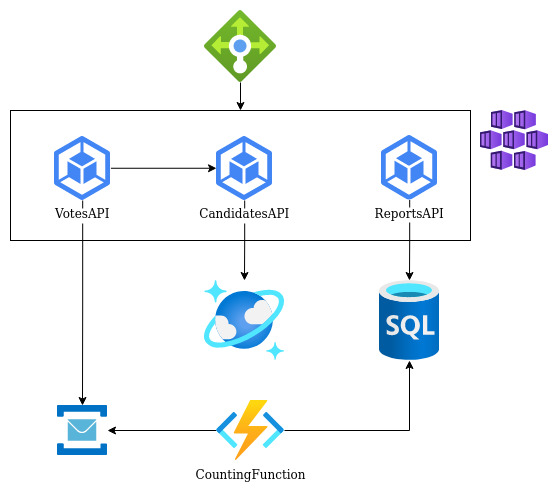
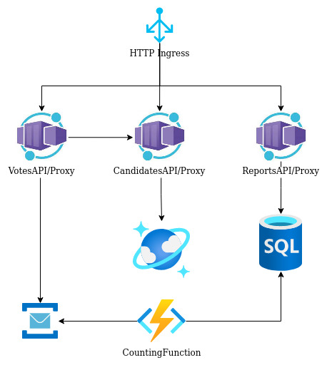

### Architecture with Azure Kubernetes Service


### Prerequisites
- Docker
- Docker Compose
- AZ CLI
- Terraform
- kubectl

Azure Kubernetes Service is an Kubernetes full-featured with Azure services integrations, like disks, load balancers, etc.

To test the application execute the command bellow and keep the output

````sh
az ad sp create-for-rbac
````

Inside the folder Infrastructure/terraform/aks create the file "terraform.tfvars" with the following content, replace the values with the result of the command above

````sh
appId=""
password=""
````

After that, execute the command bellow at aks folder

````sh
terraform init
terraform apply -auto-approve
````

Wait terraform finish, go to Azure Portal, get DNS of your AKS cluster, replace the host value inside 9-ingress.yaml file, follow the format election.<DNS FROM AKS>.
Inside the folder aks, apply the file again

````sh
kubectl apply -f k8s/9-ingress.yaml 
````

Finally, relace the host inside http files at aks/requests folder and test the application.

### Architecture with Azure Container Apps


### Prerequisites
- Docker
- Docker Compose
- AZ CLI
- Terraform

Azure Container Apps is an Kubernetes without complexity, but not all features are available. Also you have KEDA and Dapr extensions for event-driven applications and a solution of side-car. Also supports auto scaling and some deploy strategies, like traffic splitting.

To test the application execute the command bellow, inside the folder Infrastructure/terraform/containerapps, and wait to finish

````sh
terraform init
terraform apply -auto-approve
````

Go to Azure Portal, find Container Apps created, copy Application URL to browser accessing Swagger page.