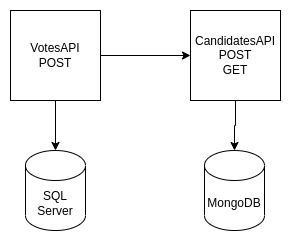

## How to execute the election API sample

### Prerequisites
- Docker
- Docker Compose
- .Net 6 SDK

### Architecture


First of all, run MongoDB and SQL Server inside docker-compose with the following:

````sh
docker-compose up
````

After all databases is running, initiate new terminal, go to the folder CandidatesAPI, and then execute:

````sh
dotnet run
````

If command fails because of server certification, execute ````dotnet dev-certs https --trust````

When CandidatesAPI is running, access https://localhost:7003/swagger/index.html and test CandidateAPI inside Swagger.

After everything is ok, go to VotesAPI folder and execute the sequence of commands bellow:

````sh
dotnet tool install -g dotnet-ef
export PATH="$PATH:/home/vscode/.dotnet/tools"
dotnet ef database update
````

After executed, SQL Server table will be created, and then execute ````dotnet run````. Access https://localhost:7193/swagger/index.html and test, trying to vote.