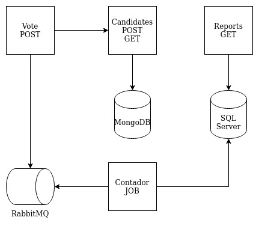
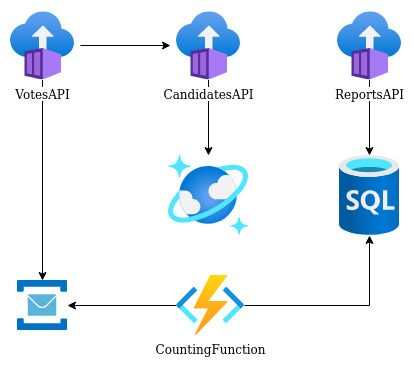

## How to execute the election API sample using Azure Container Instances and Azure Function

### Prerequisites
- Azure account
- Docker
- VSCode
- Azure extension on VSCode
- [Azure Function Tools](https://docs.microsoft.com/pt-br/azure/azure-functions/functions-run-local?tabs=v4%2Clinux%2Ccsharp%2Cportal%2Cbash)
- .Net 6 SDK

### Architecture local with Docker Compose


Locally just run ```` docker compose up --build ```` at root folder.

### Architecture inside Azure using Function


First let's create an [Azure Container Registry](https://docs.microsoft.com/en-us/azure/container-registry/container-registry-get-started-portal?tabs=azure-cli), inside Azure Portal.

Build docker images inside the project, tag them with registry name and push to private container registry Azure. This version of project has three images to push, CandidatesAPI, VotesAPI and ReportsAPI.

Now create the databases [Azure SQL Database](https://docs.microsoft.com/en-us/azure/azure-sql/database/single-database-create-quickstart?view=azuresql&tabs=azure-portal) and [CosmosDB API MongoDB](https://docs.microsoft.com/en-us/azure/cosmos-db/mongodb/create-mongodb-java). Now we need a queue to store the votes, so create [Azure Service Bus](https://docs.microsoft.com/en-us/azure/service-bus-messaging/service-bus-dotnet-get-started-with-queues).

At this time, we will host ours containers in [Azure Container Instances](https://docs.microsoft.com/en-us/azure/container-instances/container-instances-quickstart-portal). When we are using ACI, the simpler way is just run the APIs images, without Proxy Reverse. 

At least, create [Azure Functions](https://docs.microsoft.com/en-us/azure/azure-functions/functions-get-started?pivots=programming-language-csharp), inside VSCode click-right on CountingFunction folder and click on Deploy to Function App.