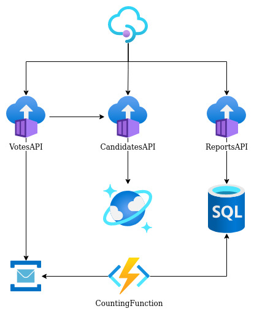

## How to execute the election API sample using Kong and KeyCloak

### Prerequisites
- Docker
- VSCode

### Architecture local with Docker Compose


Locally just run ```` docker compose up --build ```` at root folder, and after run ```` docker compose run -it --rm kong kong migrations bootstrap ```` for Kong database migration.

Open KeyCloak address at [http://localhost:8180/](http://localhost:8180/), user: admin and password: admin. Follow the steps in the reference bellow to create realm named bootcamp, two clients and user at KeyCloak.

Create a client for Kong, change the fields bellow and save:

|  Id  |  Access type  | Service account |     Root url     | Validate redirect |
|------|---------------|-----------------|------------------|-------------------|
| kong | confidential  |     enabled     | http://kong:8000 |      /mock/*      |

Now create the second client for app:

|  Id  |  Validate redirect |
|------|--------------------|
| app  |        app         |

Finaly create the user, set the fields bellow and save:

|  Username |         E-mail         | First name | Last name  | E-mail verified |
|-----------|------------------------|------------|------------|-----------------|
|   joao    | jhvictorino@gmail.com  |    João    |  Victorino |       true      |

After go to credentials tab, fill password with "Teste@admin123" and switch off temporary flag, click on Set Password.
Let's configure Kong to secure ours APIs, OIDC plugin is already installed in Kong, but we need to configure it, execute the command bellow, replacing with your values:

````sh
curl -s -X POST http://localhost:8001/plugins \
  -d name=oidc \
  -d config.client_id=kong \
  -d config.client_secret=[kong app client secret inside KeyCloak] \
  -d config.bearer_only=yes \
  -d config.realm=bootcamp \
  -d config.introspection_endpoint=http://[KeyCloak docker IP]:8080/realms/bootcamp/protocol/openid-connect/token/introspect \
  -d config.discovery=http://[KeyCloak docker IP]:8080/auth/realms/bootcamp/.well-known/openid-configuration
````

Visualize the configuration inside Konga at [http://localhost:1337/](http://localhost:1337/), go to plugins and click on oidc. If it's your first time at Konga, then create your user and set Kong Admin API http://kong:8001 to Konga.

Inside Konga UI let's import routes and services needed for election API, find konga_snapshot.json file inside Kong folder and import just services and routes, after that execute requests files.

Reference - [https://github.com/d4rkstar/kong-konga-keycloak](https://github.com/d4rkstar/kong-konga-keycloak)

## How to execute the election API sample using Azure APIM and Active Directory B2C

### Prerequisites
- Azure account
- Azure client (command-line)
- Docker
- VSCode
- Azure extension on VSCode
- [Azure Function Tools](https://docs.microsoft.com/pt-br/azure/azure-functions/functions-run-local?tabs=v4%2Clinux%2Ccsharp%2Cportal%2Cbash)
- .Net 6 SDK
- Terraform

### Architecture inside Azure


Go to Infrastructure/Terraform folder and execute commands bellow:

````sh
terraform init
terraform apply -auto-approve
````

After terraform execution, go to Azure Portal import OpenAPI.json file inside API Management, and set backend http endpoint of ACI as following:

CandidatesAPI
http://election.eastus.azurecontainer.io/api

VotesAPI
http://election.eastus.azurecontainer.io:81/api

ReportsAPI
http://election.eastus.azurecontainer.io:82/api

Test the API!