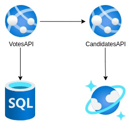

## How to execute the election API sample on Azure using PaaS

### Prerequisites
- Azure account
- VSCode
- Azure App Service extension on VSCode
- .Net 6 SDK

### Architecture


Go to Azure Portal and create the two databases, [Azure SQL Database](https://docs.microsoft.com/en-us/azure/azure-sql/database/single-database-create-quickstart?view=azuresql&tabs=azure-portal) and [CosmosDB API MongoDB](https://docs.microsoft.com/en-us/azure/cosmos-db/mongodb/create-mongodb-java). Don't forget to create the SQL database without no existing data, empty.

After all databases is running, go to CandidatesAPI folder in the appsettings.json file, and change the connection string of CosmosDB, you can get the connection string in Azure Portal. Do the same for VotesAPI, changing the connection string of SQL Server with the user password created on Azure Portal.

Next step is to create two [Web Apps](https://docs.microsoft.com/en-us/azure/app-service/quickstart-dotnetcore?tabs=net60&pivots=development-environment-vscode) on Azure.

First create the candidates API Web App, and then create the votes API, changing candidates API address inside appsettings.json of votes API, you can get candidate API address inside Azure Portal. Execute the following commands to generate publish folder from terminal inside root folder project.

````sh
cd CandidatesAPI
dotnet publish -c Release -o ./publish
cd ../VotesAPI
dotnet publish -c Release -o ./publish
````

To publish the API we will use Azure VSCode Extension, go to the extension open App Services and look the App Services we created in the Azure Portal, go to the project, click right on publish folder, inside CandidatesAPI, and Deploy to Web App, after publishing is ok, repeat the steps on VotesAPI folder.

Create the database and tables using migration, inside VotesAPI project execute the following command:

````sh
dotnet tool install -g dotnet-ef
export PATH="$PATH:/home/vscode/.dotnet/tools"
dotnet ef database update
````

After all, access the APIs address and test.